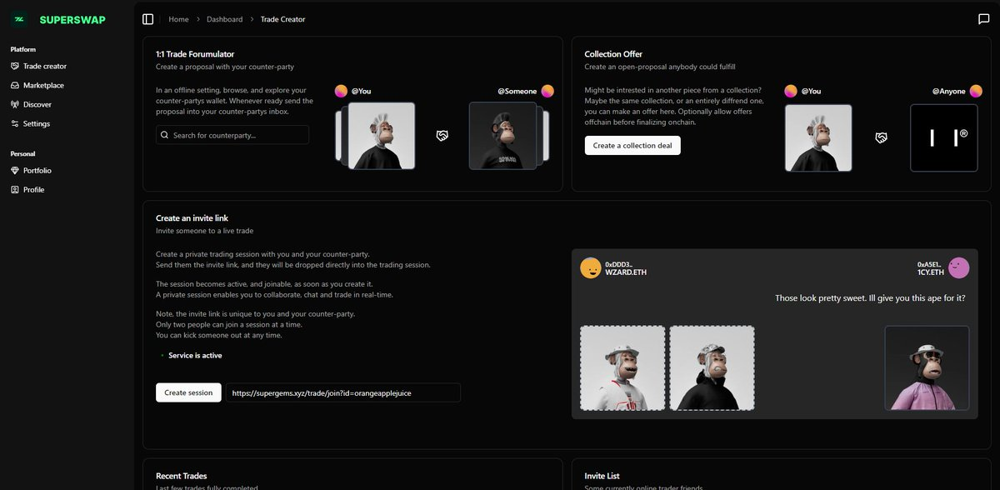

# an idea

[text](https://x.com/1CYETH/status/1855794103407055125)

An idea long underway. This is an old as fuck repo, and an old as fuck project.
I spent a half year-ish developing this after my degree – ended up getting a job in a very contradicting field, and had to disband and shut this project completely down as a requirement.

I still like to believe that this could be a product one day, as I think the problem it's trying to solve still exists.

Now a year after, and in my new job, I’ve decided to at least make the repo public, because well, why not.
The code is not pretty, and has been under various iterations. I originally started out with a completely different idea, and it also contains some very random features — built in boredom and curiosity, not really as a production-ready feature (hence its original repo name “an-idea”). Also played with it being casino games at one point.

Oh, and I also switched basically all the technology used out, at least a few times.
At the point of publishing the repo, I went through and removed secrets, and a huge chunk of deprecated code.

Features (as I remember them lol)
- Live trading p2p in a live UX (includes creating / joining rooms, chatting in said rooms, trade estimations, etc.)
- An async trading protocol that allows for ERC712, ERC20, ERC1155 trading on Ethereum & other ETH L2
- Collection-based offer trades
- Rarity indexes, and aggregated FP per NFT
- Profile pages, comments, “REP”, user customizations
- Cross-platform PWA
- Maybe a minting feature on an admin page? — I remember having to mint different sorts of NFTs to test with on testnets (Sepolia & Goerli (if that isn’t fully dead now?))
- Daily notifications about your portfolio’s health
- A statistics page on your portfolio over its lifetime (naturally also prior to signing up)
- Native currency translation to those stats ^
- Notifications on various wallet activity

To give a quick rundown of what this code contains:
- Nonce signature transaction authentication (proving you hold the crypto wallet)
- Multiple serverless functions running async on DB events (Firebase)
- A Firebase DB, a model of this DB is somewhere in my Obsidian vault? (remember to attach it, maybe)
- A contract agent, watching X amount of ETH contracts reacting to events — these events are stored in Firebase, and then processed by the serverless funcs
    - ^ I don’t remember if I fully switched to OpenSea’s Seaport exchange contract (I originally had my own ETH swap contract, but switched for a better tested and proven contract)
    - ^ Naturally various ABIs for contracts I don’t remember anymore
- 3 servers — one for the p2p live trading, one for other user-related things (I think I maybe merged them)?, and one for notifications (also works on phone yipee)
- A UI built with Next & shadcn
- PWA
- Various web3 frontend tools to integrate wallets (Rainbow, Wagmi, Ethers)
- Old ETH contracts
- Ah, completely forgot the last one! It’s a separate docs folder containing all documentation for the project (mostly for show and privacy policy), naturally hosted on a subdomain
- Full CI/CD pipeline (Vercel AND Heroku (cron jobs on there))
- Protected endpoints with JWT tokens
- User permission hierarchy

I imagine it could be hard to set up from scratch

Also when i made chatgpt fix typos, it said i had a "honest and raw tone", and it liked it, and i like that it liked it
